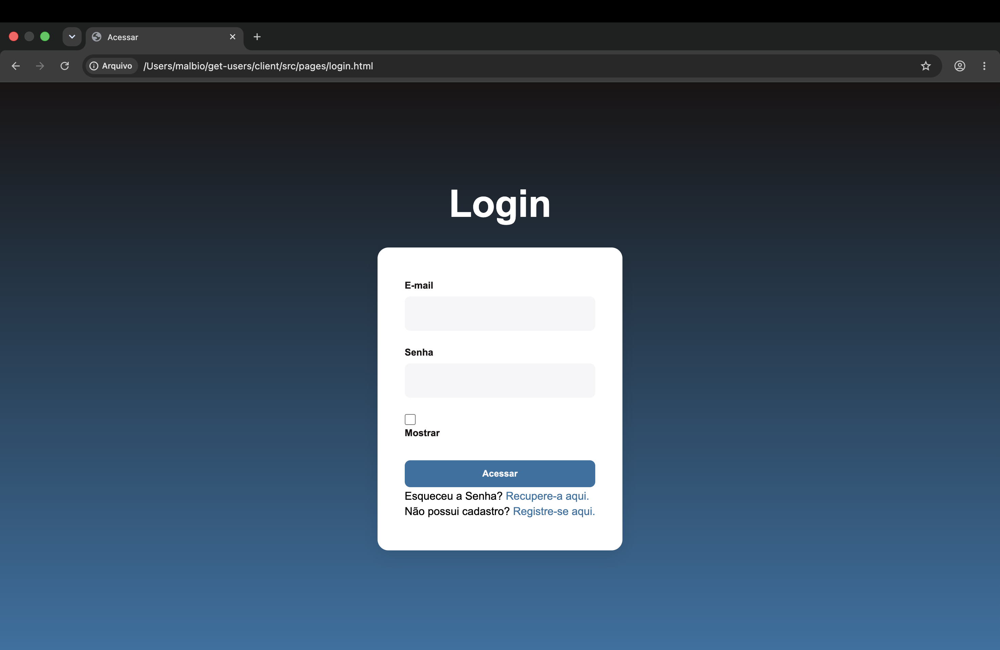

# Get Users

Projeto de estudo Full Stack com back-end em Node.js (sem framework) e front-end em HTML/CSS/JavaScript puro. O objetivo é praticar consumo de API, manipulação de DOM e simulação de autenticação no navegador.

## Estrutura do projeto

```
get-users/
├── server/                 # Back-end
│   └── src/
│       ├── server.js           # Servidor HTTP
│       ├── routers/            # Roteamento das requisições
│       ├── controllers/        # Formatação da resposta HTTP
│       ├── services/           # Regra de negócio
│       └── mocks/              # Dados fake (simulando banco de dados)
│
└── client/                 # Front-end
    ├── index.html               # Tela de busca de usuário por id
    ├── app.js
    └── src/
        ├── pages/
        │   ├── login.html
        │   └── register.html
        └── scripts/
            ├── login.js
            └── register.js
```

## Tecnologias

- Node.js (módulo `http` nativo, sem framework)
- JavaScript (ES Modules)
- HTML5
- `fetch` API
- `sessionStorage` (simulação de autenticação)

## Como rodar

```bash
cd server
npm run dev
```

O servidor sobe em `http://localhost:3000`.

Abra o `client/index.html` no navegador para testar a busca de usuários, ou os arquivos em `client/src/pages/` para testar login/registro.

## Rotas da API

| Método | Rota | Descrição |
|---|---|---|
| GET | `/users` | Retorna todos os usuários (mock) |

## Funcionalidades implementadas

- Listagem de usuários via API (back-end) consumida pelo front-end com `fetch`
- Busca de usuário por `id` no front-end
- Cadastro simulado de usuário (`sessionStorage`)
- Login simulado, validando contra os dados salvos no `sessionStorage`
- Toggle de mostrar/ocultar senha no formulário de login (checkbox alterna o `type` do input entre `password` e `text`)
- Design as telas de login,register,recovery e home



## Observações

Projeto em desenvolvimento contínuo como parte de um estudo de programação Full Stack. Simulações de autenticação (`sessionStorage`) são apenas para fins didáticos e não devem ser usadas em produção.